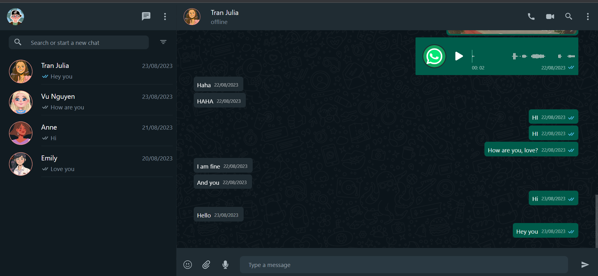
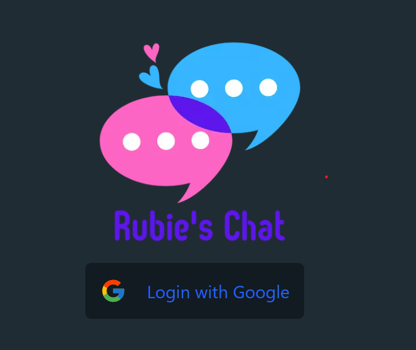
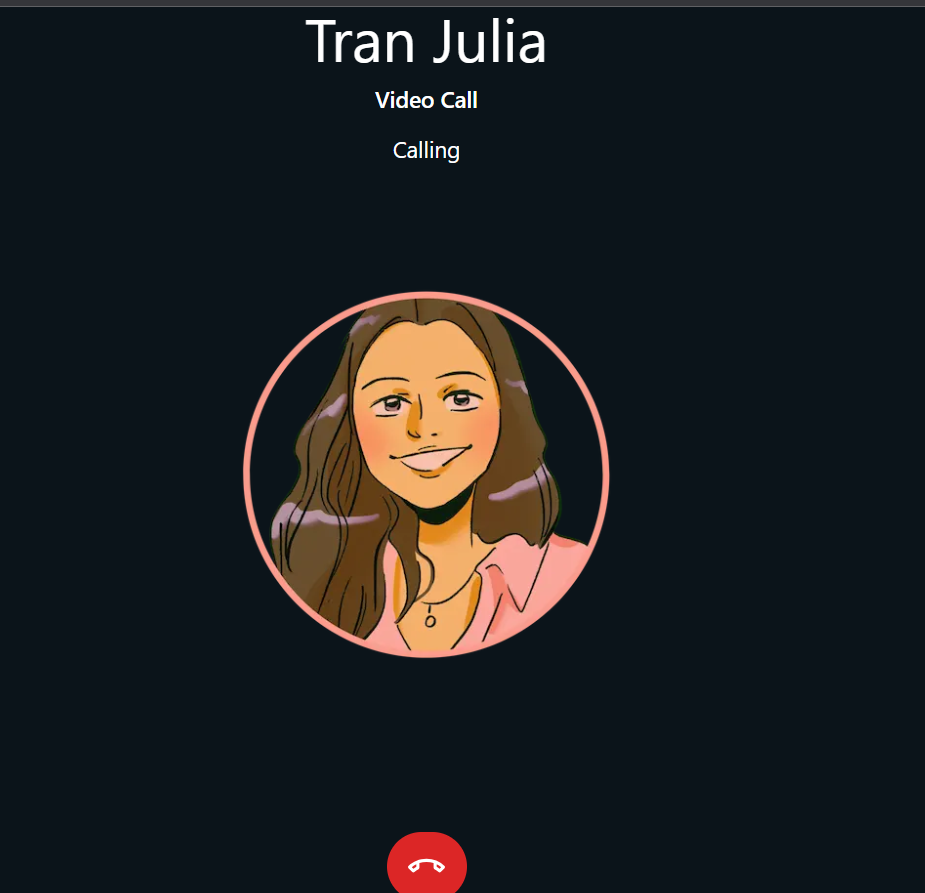
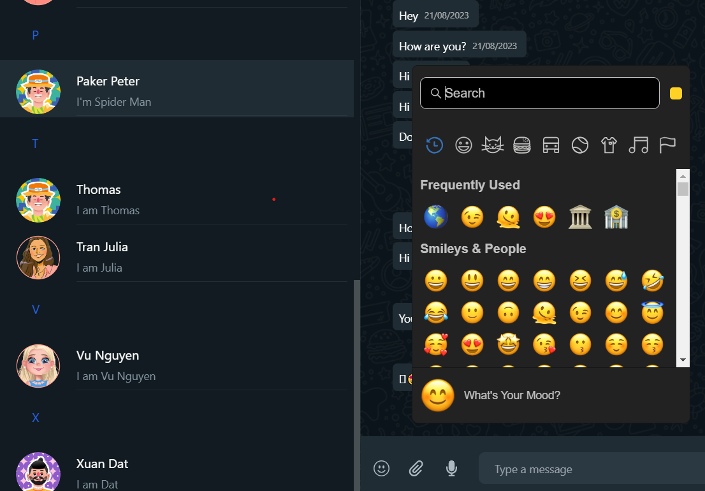

# Rubiesapp, similar to Whatsapp

## With features:
- Login with Google using Firebase.

- Switch between multiple databases using Prisma.
- Send and Receive Messages using Sockets: Real-time messaging capabilities using Socket.io for instant communication.
- Voice Call and Video Call Feature.

- Voice Notes with Live Audio Waveforms.
- Support for Emoji.

- Send Images.
- Online/Offline Functionality
- Search Messages.
- Capture Photo From Camera.
- Message Read Status.
- Message Time.
